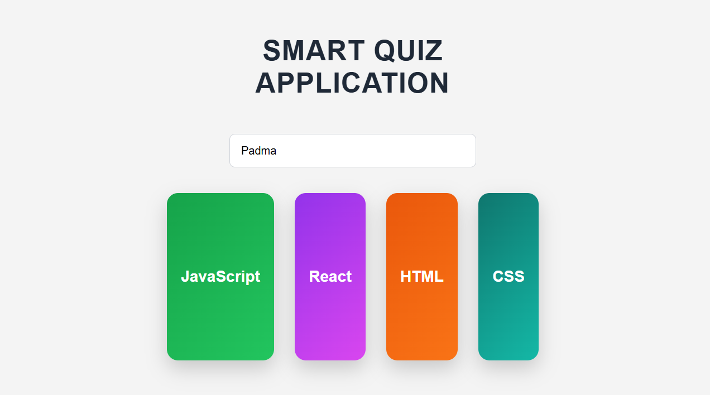
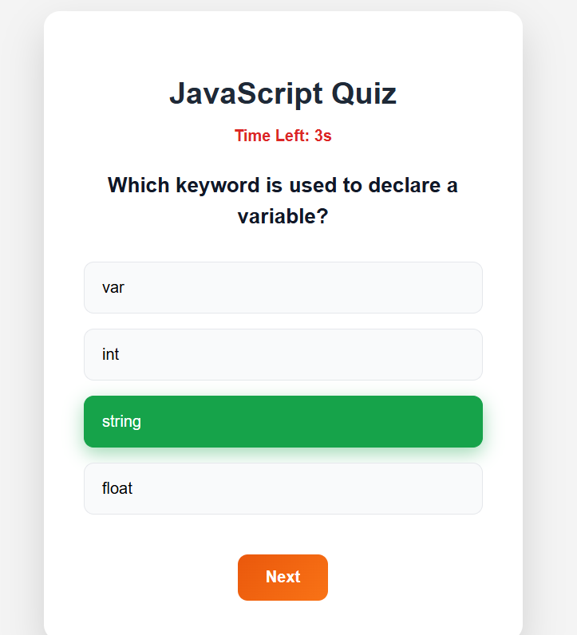
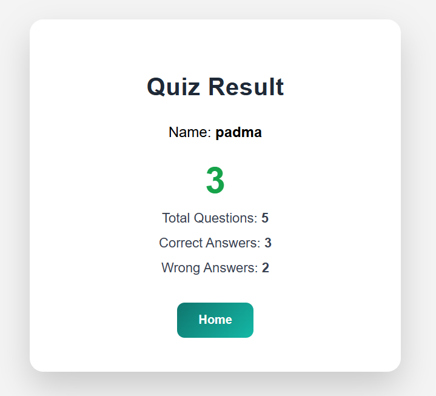

# 🚀 ConceptCheck  
## 🧠 Smart Quiz Application  

#### ConceptCheck is a React-based quiz application that allows users to select topics, take quizzes, and get instant results.

---

🔥 **Project Overview**  
- React application for interactive quizzes across multiple topics (JavaScript, React, HTML, CSS).  
- Users enter their name and select a topic to start the quiz.  
- Each quiz question has a 10-second timer and multiple-choice answers.  
- Instant feedback with total score, correct, and wrong answers displayed on the Result page.  
- Fully frontend-based with state management using React hooks (`useState`, `useEffect`).  

---

🧩 **Key Features**  

📝 **Quiz Functionality**  
- Start quiz by selecting a topic and entering player name.  
- Navigate through questions with Next button.  
- Timer counts down from 10 seconds per question.  

📊 **Quiz Feedback**  
- Result page shows player name, total questions, correct answers, and wrong answers.  

⚡ **Interactive UI**  
- Responsive design with visually appealing cards and buttons.  
- Hover and active animations for better user experience.  

---

🛠 **Tech Stack**  

| Category   | Technologies Used                     |
|------------|--------------------------------------|
| Frontend   | React.js, JavaScript (ES6+), HTML5, CSS3 |

---

📁 **Folder Structure**  

ConceptCheck/  
│  
├── src/  
│   ├── components/          # Home, Quiz, Result components  
│   ├── data/                # Questions JSON data  
│   ├── App.jsx              # Main app component  
│   └── index.js             # React entry point  
│  
└── README.md  

---

⚙️ **Setup Instructions**  

1️⃣ **Clone the Repository**  
```bash
git clone https://github.com/Padma-darsi/conceptCheck-Smart-quizz-application.git
cd conceptCheck-Smart-quizz-application
```
2️⃣ **Install Dependencies**
```bash
npm install
```

3️⃣ **Start the App**
```bash
npm start
```
The app will run on http://localhost:3000
 by default.

## 📸 Screenshots

Home Page


Quiz Page


Result Page



## 📝 Contributing

-Fork the repository

-Create a feature branch (git checkout -b feature/AmazingFeature)

-Commit your changes (git commit -m 'Add some AmazingFeature')

-Push to the branch (git push origin feature/AmazingFeature)

-Open a Pull Request
